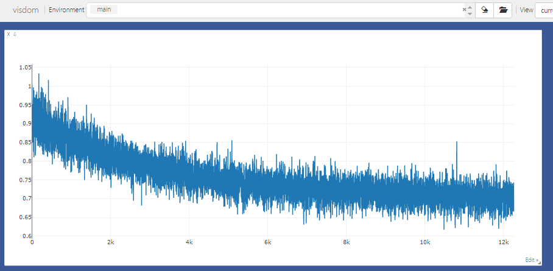

# Rasch Model for Python

This repository implements Rasch model using torch library.
Using (student, skill, response) triplets appearing on the assistment dataset, Rasch model is trained using backpropagation on the negative [log joint likelihood](https://en.wikipedia.org/wiki/Rasch_model_estimation). 

Dataset attached is made from ASSISTment dataset using both skill-buider and non-skill-builder with samples having at least one skill tags. First row represents student id, second skill sequence, third correctness of response. Students with more than or equal to 4 sequence length was splitted into train and test with 3:1 ratio. If its length does not exceed 3, the sample belongs to train set only. This data split scheme was designed to evaluate effects of individual student modeling. 

Though I present preprocessing code and raw datasets here, you can also download them in the official [website](https://sites.google.com/site/assistmentsdata/home/assistment-2009-2010-data)!

### Requirements

- torch
- visdom
- tqdm

### How to Run

```
python -m visdom.server
python rasch_main.py
python inference.py
```

To see train negative log likelihood, enter [localhost:8097](http://localhost:8097)!



### Result

```
Skill Builder and Non Skill Builder combined
ACC : 0.577271 | AUC : 0.601334
```

### To Do

 - Not to infer samples with students or questions that were not present in train set : This is suspected as a main cause of poor inference results.
 - Log nll loss with epoch average, not the latest one value.